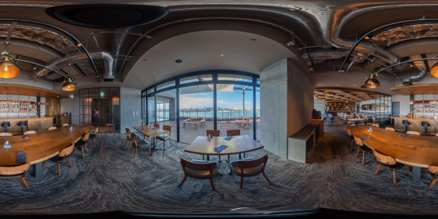
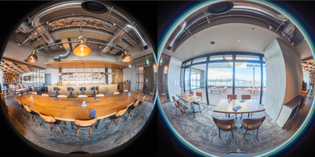

# RICOH THETA API

## Develop Apps for RICOH THETA

Use the API and SDK provided by RICOH to develop your own original RICOH THETA apps.  
Join us in sharing the joy of 360° photography with the world.  

## Explore new ways to enjoy RICOH THETA

Start developing apps for RICOH THETA on iOS and Android platforms.  

* [RICOH THETA API](../../README.md#ricoh-theta-api)  
* [RICOH THETA SDK](../../README.md#ricoh-theta-sdk)  

## Protocol Specifications

#### WebAPI
| Model | Standards | IP Address | Port | Reference |
|:--|:--|:--:|:--:|:--|
| RICOH THETA (2013) / m15 | [PTP over TCP-IP](http://www.cipa.jp/ptp-ip/contents_e/01guide_e.html) (PTP-IP) | 192.168.1.1 | 15740 | [THETA WebAPI v1.0](../../theta-web-api-v1.0/README.md) |
| RICOH THETA S / RICOH THETA SC | [OSC Protocol](https://developers.google.com/streetview/open-spherical-camera/) based | 192.168.1.1 | 80 | [THETA WebAPI v2.0](../../theta-web-api-v2.0/README.md) |
| RICOH THETA S\*1 / SC / V / Z1 / X  | [OSC Protocol](https://developers.google.com/streetview/open-spherical-camera/) based | 192.168.1.1 | 80 | [THETA WebAPI v2.1](../../theta-web-api-v2.1/README.md) |

\*1 Firmware v1.62 and later  

#### USB-MTP API
| Model | Standards | Reference |
|:--|:--|:--|
| RICOH THETA S\*2 / SC / V / Z1 / X | [Media Transfer Protocol](https://www.usb.org/sites/default/files/MTPv1_1.zip) (MTP) | [THETA USB API](../../theta-usb-api/README.md) |

\*2 With firmware v1.42 and later, shooting is now possible even when connected to a PC via USB.  

#### Bluetooth API
| Model | Standards | Reference |
|:--|:--|:--|
| RICOH THETA V / Z1 / X | [Bluetooth Low Energy](https://www.bluetooth.org/DocMan/handlers/DownloadDoc.ashx?doc_id=286439) | [THETA Bluetooth API](../../theta-bluetooth-api/README.md) |

## Available Features

* [RICOH THETA X](#ricoh-theta-x)  
* [RICOH THETA V, RICOH THETA Z1](#ricoh-theta-v-ricoh-theta-z1)  
* [RICOH THETA S firmware v1.42 and later, RICOH THETA SC](#ricoh-theta-s-firmware-v142-and-later-ricoh-theta-sc)  
* [RICOH THETA S firmware v1.41 and earlier](#ricoh-theta-s-firmware-v141-and-earlier)  
* [RICOH THETA m15](#ricoh-theta-m15)  
* [RICOH THETA (2013)](#ricoh-theta-2013)  

#### RICOH THETA X

| Method | Capture image | Record Video | Aquire Files | Delete Files | Set DateTime | Control WLAN | Switch Capture Mode | Live Preview |
|:--|:--:|:--:|:--:|:--:|:--:|:--:|:--:|:--:|
| On-device UI |  |  |  |  |  |  |  |  |
| Wireless LAN |  |  |  |  |  |  |  |  |
| USB-MTP |  |  |  |  |  |  |  |  |
| Bluetooth |  |  |  |  |  |  |  |  |

: In certain cases, recording may be disabled depending on the video mode or remaining battery level.  

#### RICOH THETA V, RICOH THETA Z1

| Method | Capture image | Record Video | Aquire Files | Delete Files | Set DateTime | Control WLAN | Switch Capture Mode | Live Preview |
|:--|:--:|:--:|:--:|:--:|:--:|:--:|:--:|:--:|
| On-device UI |  |  |  |  |  |  |  |  |
| Wireless LAN |  |  |  |  |  |  |  |  |
| USB-MTP |  |  |  |  |  |  |  |  |
| Bluetooth |  |  |  |  |  |  |  |  |

#### RICOH THETA S firmware v1.42 and later, RICOH THETA SC

| Method | Capture image | Record Video | Aquire Files | Delete Files | Set DateTime | Control WLAN | Switch Capture Mode | Live Preview |
|:--|:--:|:--:|:--:|:--:|:--:|:--:|:--:|:--:|
| On-device UI |  |  |  |  |  |  |  |  |
| Wireless LAN |  |  |  |  |  |  |  |  |
| USB-MTP |  |  |  |  |  |  |  |  |
| Bluetooth |  |  |  |  |  |  |  |  |

#### RICOH THETA S firmware v1.41 and earlier

| Method | Capture image | Record Video | Aquire Files | Delete Files | Set DateTime | Control WLAN | Switch Capture Mode | Live Preview |
|:--|:--:|:--:|:--:|:--:|:--:|:--:|:--:|:--:|
| On-device UI |  |  |  |  |  |  |  |  | Power ON/OFF, Wireless LAN ON |
| Wireless LAN |  |  |  |  |  |  |  |  | Assumptions of this Document |
| USB-MTP |  |  |  |  |  |  |  |  | Assumptions of this Document |
| Bluetooth |  |  |  |  |  |  |  |  | Power ON/OFF, Wireless LAN ON Assumptions of this Document |

#### RICOH THETA m15

| Method | Capture image | Record Video | Aquire Files | Delete Files | Set DateTime | Control WLAN | Switch Capture Mode | Live Preview |
|:--|:--:|:--:|:--:|:--:|:--:|:--:|:--:|:--:|
| On-device UI |  |  |  |  |  |  |  |  |
| Wireless LAN |  |  |  |  |  |  |  |  |
| USB-MTP |  |  |  |  |  |  |  |  |
| Bluetooth |  |  |  |  |  |  |  |  |

#### RICOH THETA (2013)

| Method | Capture image | Record Video | Aquire Files | Delete Files | Set DateTime | Control WLAN | Switch Capture Mode | Live Preview |
|:--|:--:|:--:|:--:|:--:|:--:|:--:|:--:|:--:|
| On-device UI |  |  |  |  |  |  |  |  |
| Wireless LAN |  |  | |  |  | |  |  |
| USB-MTP |  |  |  |  |  |  |  |  |
| Bluetooth |  |  |  |  |  |  |  |  |

## Projection Type

RICOH THETA generates two types of images.

#### Equirectangular
https://en.wikipedia.org/wiki/Equirectangular_projection
 

#### Dual Fisheye

 

### Supported Image Format

<table style="width: 80%;">
  <thead>
    <tr>
      <th style="text-align: left">Model</th>
      <th style="text-align: left">Projection Type</th>
      <th style="text-align: left">Format</th>
      <th style="text-align: left">Image Size</th>
    </tr>
  </thead>
  <tbody>
    <tr>
      <td>RICOH360 THETA A1</td>
      <td>Equirectangular / Dual Fisheye</td>
      <td>JPEG</td><td>11008x5504 / 5504x2752</td>
    </tr>
    <tr>
      <td>RICOH THETA X</td>
      <td>Equirectangular / Dual Fisheye</td>
      <td>JPEG / DNG*2</td><td>11008x5504 / 5504x2752</td>
    </tr>
    <tr>
      <td rowspan="3">RICOH THETA Z1</td>
      <td>Equirectangular</td>
      <td>JPEG</td>
      <td>6720x3360</td>
    </tr>
    <tr>
      <td>Dual Fisheye</td>
      <td>JPEG</td>
      <td>7296x3648</td>
    </tr>
    <tr>
      <td>Dual Fisheye</td>
      <td>DNG</td>
      <td>7296x3648</td>
    </tr>
    <tr>
      <td rowspan="2">RICOH THETA V</td>
      <td>Equirectangular</td>
      <td>JPEG</td><td>5376x2688</td>
    </tr>
    <tr>
      <td>Dual Fisheye*1</td>
      <td>JPEG</td><td>5792x2896</td>
    </tr>
    <tr>
      <td>RICOH THETA S / SC</td>
      <td>Equirectangular</td><td>JPEG</td>
      <td>5376x2688 / 2048x1024</td>
    </tr>
    <tr>
      <td>RICOH THETA (2013) / m15</td>
      <td>Equirectangular</td><td>JPEG</td>
      <td>3584x1792</td>
    </tr>
  </tbody>
</table>

\*1 RICOH THETA V firmware v3.00.1 and later  
\*2 RICOH THETA X firmware v2.61.0 and later  

### Supported Video Format

| Model | Projection Type | Container | Codec | Video Size |
|:--|:--|:--|:--|:--|
| RICOH360 THETA A1 | Equirectangular /  Dual Fisheye | MP4 | H.264/AVC, H.265/HEVC | 7680x3840 / 5760x2880 / 3840x1920 / 1920x960 |
| RICOH THETA X | Equirectangular /  Dual Fisheye | MP4 | H.264/AVC | 7680x3840 / 5760x2880 / 3840x1920 / 1920x960 |
| RICOH THETA V / Z1 | Equirectangular /  Dual Fisheye | MP4 | H.264/AVC | 3840x1920 / 1920x960 |
| RICOH THETA S / SC | Dual Fisheye | MP4 | H.264/AVC | 1920x1080 / 1280x720 |
| RICOH THETA m15 | Dual Fisheye | MOV | H.264/AVC | 1920x1080 |
| RICOH THETA (2013) | *Not Supported* ||||

### Metadata Specifications

Please refer to [RICOH THETA Metadata Spec](../../theta-metadata/README.md).

### Supported Live Preview Format

| Model | Projection Type | Codec | Preview Size |
|:--|:--|:--|:--|
| RICOH360 THETA A1 | Equirectangular / Dual Fisheye | Motion JPEG | 1024x512 |
| RICOH THETA X | Equirectangular / Dual Fisheye | Motion JPEG | 1024x512 / 1920x960 / 3840x1920 |
| RICOH THETA V / Z1 | Equirectangular / Dual Fisheye | Motion JPEG | 640x320 / 1024x512 / 1920x960 / 3840x1920 |
| RICOH THETA S\*1 / SC\*1 | Equirectangular | Motion JPEG | 640x320 |
| RICOH THETA m15 | *Not Supported* ||||
| RICOH THETA (2013) | *Not Supported* ||||

*1 Supported on only still image mode

### Supported Live Streaming Protocol (Video)

| Model | Projection Type | I/F | Codec | Video Size / Frame Rate |
|:--|:--|:--|:--|:--|
| RICOH360 THETA A1 | *Not Supported* |||||
| RICOH THETA X | Equirectangular | UVC1.5[^1] | H.264/AVC | 3840x1920 30/15fps, 1920x960 30/15fps |
| RICOH THETA V / Z1 | Equirectangular | UVC1.5[^1] | H.264/AVC | 3840x1920 30fps, 1920x960 30fps |
| RICOH THETA SC2 | *Not Supported* |||||
| RICOH THETA SC  | *Not Supported* |||||
| RICOH THETA S | Dual Fisheye | HDMI | YCbCr | 1920x1080 30fps, 1280x720 30fps, 720x480 30fps |
|               |              | UVC1.5[^1] | H.264/AVC, Motion JPEG | 1920x1080 30fps |
|               |              | UVC1.1[^2] | Motion JPEG | 1280x720 15fps |
| RICOH THETA m15    | *Not Supported* ||||
| RICOH THETA (2013) | *Not Supported* ||||

[^1]: [Universal Serial Bus Device Class Definition for Video Devices Revision 1.5](https://www.usb.org/sites/default/files/USB_Video_Class_1_5.zip)
[^2]: [Universal Serial Bus Device Class Definition for Video Devices Revision 1.1](https://www.usb.org/sites/default/files/USB_Video_Class_1_1_090711.zip)

### Supported Live Streaming Protocol (Audio)

| Model | I/F | Codec |
|:--|:--|:--|
| RICOH360 THETA A1 | *Not Supported* ||
| RICOH THETA X      | UAC2.0[^3] | AAC |
| RICOH THETA V / Z1 | UAC2.0[^3] | AAC |
| RICOH THETA SC2 | *Not Supported* ||
| RICOH THETA SC  | *Not Supported* ||
| RICOH THETA S      | UAC1.0[^4] | AAC |
| RICOH THETA m15    | *Not Supported* ||||
| RICOH THETA (2013) | *Not Supported* ||||

[^3]: [Universal Serial Bus Device Class Definition for Audio Devices Release 2.0](https://www.usb.org/sites/default/files/Audio2.0_final.zip)  
[^4]: [Universal Serial Bus Device Class Definition for Audio Devices Release 1.0](https://www.usb.org/sites/default/files/audio10.pdf)  
