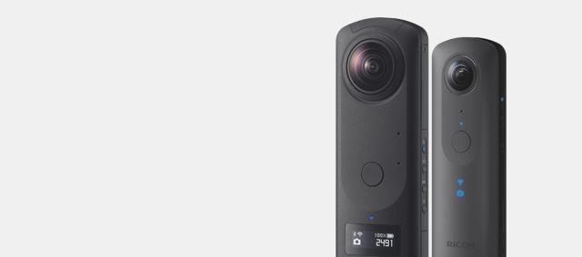

# RICOH THETA API

### Developing apps for RICOH THETA

Use the API and SDK supplied by Ricoh to develop your own original RICOH THETA apps. Join us in spreading the enjoyment of "spherical" photography around the world.

## Suggest new ways to enjoy RICOH THETA
Start developing apps for RICOH THETA on iOS and Android platforms.  

* API - Click [here](../../README.md#ricoh-theta-api) for the documents on RICOH THETA API  

* SDK - Click [here](./theta-sdk.md#ricoh-theta-api)  to download RICOH THETA SDK  

## Use any of these functions
You can use any of the functions included in the RICOH THETA to develop your own original app.

### Shoot spherical images
  
Shooting with the remote shutter.

### Shoot with manual settings
  
ISO, shutter speed, exposure compensation settings.

### Shooting spherical videos *
  
Remote start/stop for video recording (*Supported by RICOH THETA m15 or later)

### Control image files on the camera
  
Acquisition of spherical images, viewing of file lists and deletion.

For more information, see developers community
Join English forum [theta360.guide](https://community.theta360.guide/) or [Japanese forum](https://join.slack.com/t/thetadeveloper/shared_invite/enQtNzcxODI2MTk2ODg0LWY5YmU2ZTIxNGYwNzlmNWZjMWMyMWFlMzY3ZmQ3NGU3ZjZiZjI0Njk4MGIxMDU5NDJiMzQ4Y2FkNDEzYmFlNGU)
(From here on, it is not a RICOH service. RICOH is not responsible for the use of information on linked websites.)
