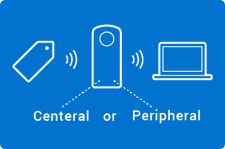
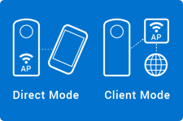
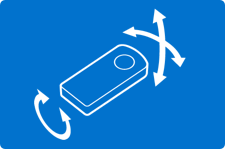

# RICOH THETA Plugin Partner Program

### Make Your THETA
Plugins can be developed for RICOH THETA cameras running the Android™ based OS. By developing plugins, amazing new features can be added to the RICOH THETA.  
[Register now](https://www8.webcas.net/db/pub/ricoh/thetaplugin/create/input)  

## Make your THETA by registering for the RICOH THETA Plugin Partner Program
The RICOH THETA Plugin Partner Program supports RICOH THETA plugin development with an Android-based OS.

RICOH THETA cameras now have an open API / SDK that both individuals and corporations can access. Everyone with an Android-based RICOH THETA camera can install programs (plugins) into the RICOH THETA. You develop the plugin using our API / SDK and Android Studio and are free to expand the functions of the RICOH THETA.

Plugin can only run on supported THETA models.

See [the overview page](./theta.md) for more detail.

Plugins you develop can be made available to the public at the RICOH THETA PLUGIN STORE. This will allow developers to share your plugin widely with many THETA users.

* The partner program is a service that supports the development of plugins that operate within the RICOH THETA itself. There is a separate SDK to develop RICOH THETA applications on smartphones. Information about the development of applications for smartphones is [here](./theta-api.md).

## What you can do with plugins
RICOH THETA plugins enable control over 360 shooting and image editing as well as control of the interface and sensors. Examples are below. For further information, please see [here](../../ricoh-theta-plugin/README.md).

#### USB
  
The USB port of the RICOH THETA can be assigned as USB Host. As long as the Android library is exposed, any device class can be used with the THETA Plugin SDK. This includes device classes such as HID, CDC, Audio Class, and more, as well as unique classes that vendors develop on their own.

#### BLE
  
RICOH THETA can use BLE and be asigned as either Peripheral or Central. The THETA can use communication protocols after a connection is established as long as the Android library is exposed. The THETA plugin SDK can import and use these libraries.

#### Wi-Fi
  
The THETA can be configured both as an access point or a client. When the THETA is in Access Point Mode, other devices can connect to it using Ad Hoc Mode. It is also possible to connect a THETA to the Access Point in Infrastructure Mode. With this mode, THETA can be connected to internet.

#### Gyro Acceleration Sensor
  
Movement of a THETA can be detected using the gyro sensor or the accelerometer.

### Plugin development examples
We provide plugins to enhance the following camera features: directional adjustment for shooting pictures, external device linkage and cloud transfer.

#### Remote Playback
  
Pre-installed in RICOH THETA model which is Android™ based OS (V, Z1 only)

#### USB Data Transfer
  
Pre-installed in RICOH THETA model which is Android™ based OS (V, Z1 only)

#### Automatic Face Blur BETA
  
[Plugin Store](https://pluginstore.theta360.com/plugins/com.theta360.automaticfaceblur/)  
[GitHub](https://github.com/ricohapi/theta-automatic-face-blur-plugin/)  

#### Wireless Live Streaming
  
[Plugin Store](https://pluginstore.theta360.com/plugins/com.theta360.cloudstreaming/)  
[GitHub](https://github.com/ricohapi/theta-wireless-live-streaming-plugin/)  

See [here](https://pluginstore.theta360.com/#official) for all RICOH Plugins.

## Service

#### Freely available with no registration
[Plugin Developer Documents](../../ricoh-theta-plugin/README.md)  
[Plugin SDK and sample applications(GitHub)](https://github.com/search?q=topic%3Atheta-plugin+org%3Aricohapi&type=Repositories)  

#### Services for partner service registrants
- Switch to 'development mode' of RICOH THETA camera
- Online support
- Post your plugin to RICOH THETA PLUGIN STORE

## How to join the partner program

### 1. Registration
First complete the application to the partner program. To register with the partner program, you need a photo of your RICOH THETA serial number. We will then review your application. Qualified applicants will be invited to join the partner program with more information on how to post to the RICOH THETA PLUGIN STORE.  
[Register now](https://www8.webcas.net/db/pub/ricoh/thetaplugin/create/input)  

Please be aware that once you register a RICOH THETA camera as a development camera, it will be fall outside of normal Ricoh support.

### 2. Develop
After completing registration, you can develop plugins using Android Studio.

Please refere these resources:  
[Plugin Developer Documents](../../ricoh-theta-plugin/README.md)  
[Plugin Policy](../../ricoh-theta-plugin/policy.md)  
[Plugin SDK and sample applications(GitHub)](https://github.com/search?q=topic%3Atheta-plugin+org%3Aricohapi&type=Repositories)  

For more information from developer community:  
[Plugin Development Tips from the Community](https://theta360developers.github.io/plugin/)  
[Independent Developer Community Forum](https://community.theta360.guide/)  
[Official Developer Community Blog (Japanese)](https://qiita.com/organizations/theta-plugin)  

You can ask technical support from [here](https://www8.webcas.net/form/pub/ricoh/partner) after login.

### 3. Publish to store
Apply the plugin that you developed from [here](https://www8.webcas.net/form/pub/ricoh/partner) to publish on [the RICOH THETA PLUGIN STORE](https://pluginstore.theta360.com/).

## Contact
Ask from [here](https://webform.ricoh.com/form/pub/e00101/support) for general questions.
