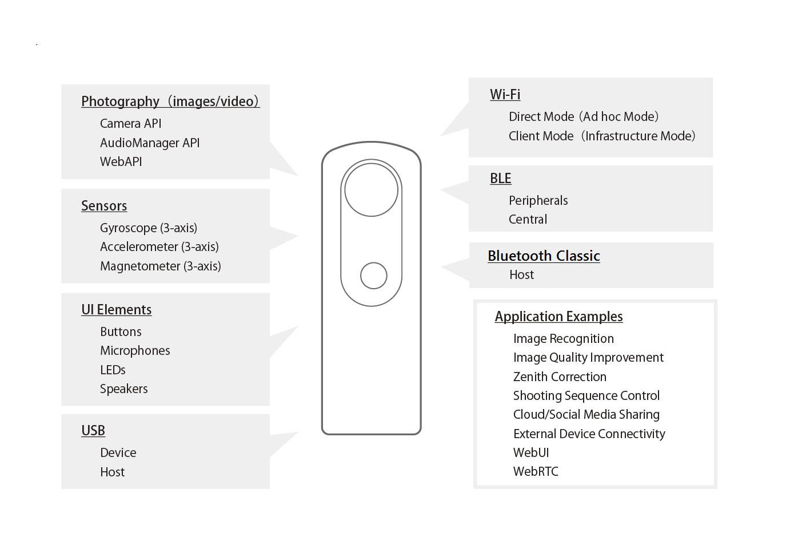
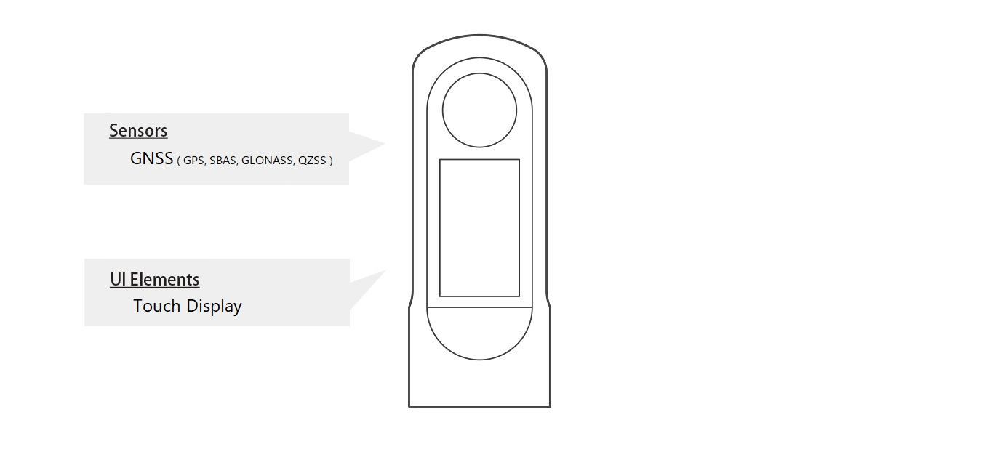

# RICOH THETA Plugin Partner Program

## Make Your THETA

Plugins can be developed for RICOH THETA cameras running an Android™-based operating system. By developing plugins, you can add powerful new features to your RICOH THETA.  

## Registering for the RICOH THETA Plugin Partner Program

The RICOH THETA Plugin Partner Program supports plugin development for RICOH THETA cameras running an Android™-based operating system.  
[Register now](https://www8.webcas.net/db/pub/ricoh/thetaplugin/create/input)  

RICOH THETA cameras now offer an open API and SDK accessible to both individuals and organizations.  
Anyone with an Android-based RICOH THETA camera can install custom programs (plugins) directly onto the device.  
You can develop plugins using our API/SDK and Android Studio, giving you the freedom to expand the camera's functionality as you like.  

> [!NOTE]  
> Plugins can only run on THETA V, THETA Z1, and THETA X.    

Plugins you develop can be published on the RICOH THETA PLUGIN STORE, making them publicly available to a wide audience of THETA users. This enables developers to share their creations broadly within the THETA community.  

## What You Can Do with Plugins

RICOH THETA plugins allow you to control 360° shooting, perform image editing, and access the device’s interface and sensors.  
Examples are provided below.  

#### USB
  
The USB port on the RICOH THETA can be configured as a USB host. As long as the corresponding Android library is available, any USB device class can be used with the THETA Plugin SDK. This includes standard classes such as HID, CDC, and Audio Class, as well as custom classes developed by individual vendors.  

#### BLE
  
RICOH THETA supports BLE and can be assigned as either a Peripheral or Central device. Once a connection is established, it can communicate using various protocols, provided that the necessary Android libraries are available. The THETA Plugin SDK can import and utilize these libraries.  

#### WLAN
  
The RICOH THETA can be configured as either an access point or a client. When operating in Access Point mode, other devices can connect to it using ad hoc mode. It is also possible to connect the THETA to an existing access point using infrastructure mode, enabling internet connectivity.  

#### IMU
  
The movement of a RICOH THETA can be detected using the gyro sensor or accelerometer.  

### Plugin Development Examples

We provide plugins that enhance camera functionality, including directional adjustment for shooting, integration with external devices, and cloud-based file transfer.  

#### Remote Playback
  
Pre-installed in RICOH THETA V and Z1  
[RICOH360 Blog](https://blog.ricoh360.com/en-plugin/remote-playback)  

#### USB Data Transfer
  
Pre-installed in RICOH THETA V and Z1  
[RICOH360 Blog](https://blog.ricoh360.com/en-plugin/usb-data-transfer)  

#### Automatic Face Blur BETA
  
[Install Plugin](https://github.com/ricohapi/theta-plugins/tree/main/plugins/com.theta360.automaticfaceblur)  
[Sample Source Code](https://github.com/ricohapi/theta-automatic-face-blur-plugin/)  
[RICOH360 Blog](https://blog.ricoh360.com/en-plugin/automatic-face-blur-beta)  

#### Wireless Live Streaming
  
[Install Plugin](https://github.com/ricohapi/theta-plugins/tree/main/plugins/com.theta360.cloudstreaming/)  
[Sample Source Code](https://github.com/ricohapi/theta-wireless-live-streaming-plugin/)  
[RICOH360 Blog](https://blog.ricoh360.com/en-plugin/wireless-live-streaming)  

See [here](https://github.com/ricohapi/theta-plugins/tree/main) for all plugins.

## Service

#### Available to All Users — No Registration Required
[Plugin API](../../README.md#ricoh-theta-plugin)  
[Plugin SDK](../../README.md#plugin-sdk-and-sample)  
[Plugin Development Tips](../../ricoh-theta-plugin/develop-tips.md)  

#### Exclusive Services for Registered Plugin Partners
* Switch your RICOH THETA device to development mode  
* Access online support  
* Distribute your plugin on the RICOH THETA PLUGIN STORE  

## How to join the RICOH THETA Plugin Partner Program

### 1. Register for the Partner Program

First, complete the application for the Partner Program. To register, you will need a photo of your RICOH THETA's serial number. Once your application is submitted, we will review it. Qualified applicants will receive an invitation to join the Partner Program, along with details on how to publish plugins to the RICOH THETA PLUGIN STORE.  
[Register now](https://www8.webcas.net/db/pub/ricoh/thetaplugin/create/input)  

> [!IMPORTANT]
> Please note that once a RICOH THETA camera is registered as a development device, it will no longer be covered by standard Ricoh customer support.  

> [!WARNING]  
> The following features are restricted on the "RICOH THETA Z1 51GB" and "RICOH THETA X" models sold in Japan:  
> 
> * Plugin operation in WLAN client mode  
> * Plugin development  
> 
> For more details, please see [here](https://topics.theta360.com/en/news/2021-04-28/).  
> If you reside in Japan and would like to develop plugins using the RICOH THETA Z1 51GB or RICOH THETA X, please see [here](https://webform.ricoh.com/form/pub/e00101/support51gb).  

### 2. Develop Plugin

After completing registration, you can start developing plugins using Android Studio.  

#### Common Features Supported by Plugin

#### Additional Features Supported by RICOH THETA X Plugin

#### Technical Documents
[Plugin API](../../README.md#ricoh-theta-plugin)  
[Plugin SDK](../../README.md#plugin-sdk-and-sample)  
[Plugin Development Tips](../../ricoh-theta-plugin/develop-tips.md)  
[Template of Plugin Policy](../../ricoh-theta-plugin/template.md)  
  
[Plugin Policy](https://github.com/ricohapi/theta-plugins/blob/main/make-your-theta/plugin-policy.md)  
[Private Policy](https://github.com/ricohapi/theta-plugins/blob/main/make-your-theta/privacy-policy.md)  
[License Agreement](https://github.com/ricohapi/theta-plugins/blob/main/make-your-theta/license-agreement.md)  

#### Communities
* [theta360.guide](https://community.theta360.guide/) - RICOH THETA developer and power user community
* [RICOH THETAプラグイン開発者コミュニティ - Qiita](https://qiita.com/organizations/theta-plugin) - Plugin developer community (Japanese)
* [theta-skunkworks](https://github.com/theta-skunkworks) - The THETA SKUNKWORKS TEAM based on the RICOH developer community

### 3. Publish Plugin to RICOH THETA PLUGIN STORE
Submit the plugin you developed via [this form](https://www8.webcas.net/form/pub/ricoh/partner) to publish it on [RICOH THETA PLUGIN STORE](https://github.com/ricohapi/theta-plugins/tree/main).  

1. **Developer** apply with the plugin information from [here](https://www8.webcas.net/form/pub/ricoh/partner).  
2. **Ricoh** issue URL to upload the necessary files (apk file, Plugin descriptive image\*1) after checking the application details.  
3. **Developer** upload the necessary files from the above URL.  
4. **Ricoh** review the plugin.  
5. **Ricoh** send approval notification.  
6. **Developer** apply to release plugin.  
7. **Ricoh** release plugin in the RICOH THETA Plugin Store.\*2  

\*1 Image size should be 960 x 520, file format is png, maximum number of 5 files, file name should be [number].png (1.png, 2.png, ...). Compress all apk and image files together into one zip file, and file name "packagename". zip please.  
\*2 It is NOT possible to specify a plugin release time.  

## Contact
For technical support, please contact us via [this forum](https://www8.webcas.net/form/pub/ricoh/partner).  
For general inquiries, please contact us via [this form](https://webform.ricoh.com/form/pub/e00101/support).  

---

> **By using the information contained in these documents, you have agreed to the following terms:**
> * The contents of this document is subject to change without notice  
> * Ricoh grants you a limited, royalty-free, non-transferable, revocable and non-exclusive license to use this document and the SDK solely for the purpose of designing or developing the THETA Plugin application software.  
> * Unless otherwise provided by RICOH, you are strictly prohibited to copy, broadcast or reproduce, in whole or in part, any information contained herein  
> * The computer programs and usage directions contained herein are only meant for reference purposes, and RICOH shall in no event make any warranty or shall be held   liable in connection with the use of this information (such disclaimer of liability shall include, but shall not be limited to third party IP infringement liabilities attributable to the use of this information)  
> * RICOH does not guarantee in any way that the functionality contained herein satisfies your needs or that the software is error-free and continues to work in proper condition  
> * No license, express, implied or otherwise is granted under this document for any patents, copyrights or other intellectual property rights of RICOH or others, unless expressly provided otherwise.  
