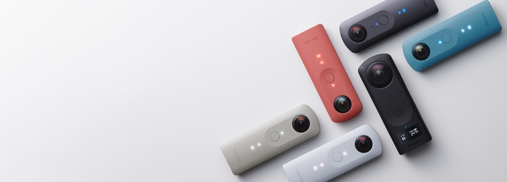

# RICOH THETA Developers

RICOH not only provides the camera hardware, but also offers an environment for developers to deliver the new value created by our 360° camera to people around the world.  
We have released the WebAPI and SDK for all RICOH THETA cameras, enabling remote control of RICOH THETA from digital devices such as smartphones, PCs, Macs, and single-board computers.  
Starting with the RICOH THETA V, to meet diverse needs, we adopted an Android™-based operating system, making it possible to develop control functions directly on the RICOH THETA itself.  

RICOH THETA is a device full of unlimited potential.  
Why not try developing a new 360° world?  

## App Development
Mainly used for remote control of RICOH THETA.  
This includes applications such as smartphone apps and the basic RICOH desktop app.  

Typical use cases include:
* When you want to remotely control the camera  
* When you want to automatically process images and videos after shooting  
* When you want to manage multiple cameras simultaneously  

[Overview of Application Development](./theta-api.md)  

#### Supported Models
THETA (2013), THETA m15, THETA S, THETA SC, THETA V, THETA Z1, THETA X

## Plugin Development

Plugins are applications that control functions on the RICOH THETA camera.
By incorporating them into the RICOH THETA, you can use plugins to enable desired features before shooting, such as a self-timer.  

Plugins are useful in the following cases:
* When you want to develop a feature that is independent of the local environment  
* When you need to install a function despite network restrictions  
* When you require a specialized feature that is unlikely to be supported by the manufacturer  
* When you want to minimize the use of external system equipment  

[Overview of Plugin Development](./theta-plugin.md)  

#### Supported Models
THETA V, THETA Z1, THETA X

#### Overview

> [!WARNING]  
> The following features are restricted on the "RICOH THETA Z1 51GB" and "RICOH THETA X" models sold in Japan:  
> 
> * Plugin operation in WLAN client mode  
> * Plugin development  
> 
> For more details, please see [here](https://topics.theta360.com/en/news/2021-04-28/).  
> If you reside in Japan and would like to develop plugins using the RICOH THETA Z1 51GB or RICOH THETA X, please see [here](https://webform.ricoh.com/form/pub/e00101/support51gb).  
