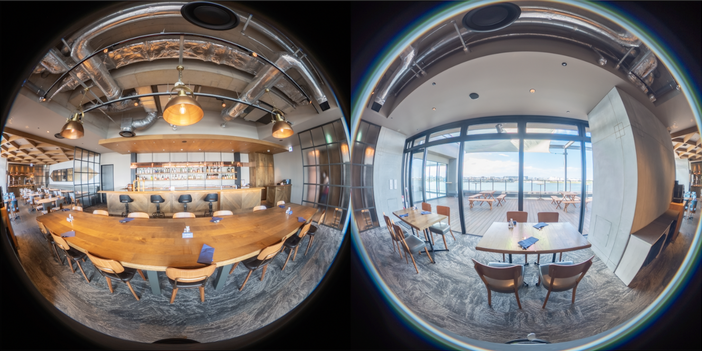

# RICOH THETA API

### Overview

The RICOH THETA camera model differs depending on when the camera was sold. The models are refered to as below. There are certain functional differences between each model.

1. RICOH THETA
2. RICOH THETA m15
3. RICOH THETA S
4. RICOH THETA SC
5. RICOH THETA V
6. RICOH THETA Z1
7. RICOH THETA X

The following operations can be performed using the RICOH THETA interface.

* [RICOH THETA](#ricoh-theta)  
* [RICOH THETA m15](#ricoh-theta-m15)  
* [RICOH THETA S firmware v1.41 or prior](#ricoh-theta-s-firmware-v141-or-prior)  
* [RICOH THETA S firmware v1.42 or later, RICOH THETA SC](#ricoh-theta-s-firmware-v142-or-later-ricoh-theta-sc)  
* [RICOH THETA V, RICOH THETA Z1](#ricoh-theta-v-ricoh-theta-z1)  
* [RICOH THETA X](#ricoh-theta-x)  

#### RICOH THETA

| I/F | Capturing images | Video shooting | Image reading | Delete | Clock adjust | Wireless LAN OFF | Switching capture mode (Still image / Video) | Live View | Others |
|:--|:--|:--|:--|:--|:--|:--|:--|:--|:--|
| Manual |  |  |  |  |  |  |  |  | Power ON/OFF, Wireless LAN ON |
| Via Wireless LAN |  |  |  |  |  |  |  |  | Assumptions of this Document |
| Via USB connection (MTP) |  |  |  |  |  |  |  |  | Assumptions of this Document |
| Via Bluetooth connection |  |  |  |  |  |  |  |  | Power ON/OFF, Wireless LAN ON Assumptions of this Document |

: All versions support  
: Not supported

#### RICOH THETA m15

| I/F | Capturing images | Video shooting | Image reading | Delete | Clock adjust | Wireless LAN OFF | Switching capture mode (Still image / Video) | Live View | Others |
|:--|:--|:--|:--|:--|:--|:--|:--|:--|:--|
| Manual |  |  |  |  |  |  |  |  | Power ON/OFF, Wireless LAN ON |
| Via Wireless LAN |  |  |  |  |  |  |  |  | Assumptions of this Document |
| Via USB connection (MTP) |  |  |  |  |  |  |  |  | Assumptions of this Document |
| Via Bluetooth connection |  |  |  |  |  |  |  |  | Power ON/OFF, Wireless LAN ON Assumptions of this Document |

: All versions support  
: Not supported

#### RICOH THETA S firmware v1.41 or prior

| I/F | Capturing images | Video shooting | Image reading | Delete | Clock adjust | Wireless LAN OFF | Switching capture mode (Still image / Video) | Live View | Others |
|:--|:--|:--|:--|:--|:--|:--|:--|:--|:--|
| Manual |  |  |  |  |  |  |  |  | Power ON/OFF, Wireless LAN ON |
| Via Wireless LAN |  |  |  |  |  |  |  |  | Assumptions of this Document |
| Via USB connection (MTP) |  |  |  |  |  |  |  |  | Assumptions of this Document |
| Via Bluetooth connection |  |  |  |  |  |  |  |  | Power ON/OFF, Wireless LAN ON Assumptions of this Document |

: All versions support  
: Not supported

#### RICOH THETA S firmware v1.42 or later, RICOH THETA SC

| I/F | Capturing images | Video shooting | Image reading | Delete | Clock adjust | Wireless LAN OFF | Switching capture mode (Still image / Video) | Live View | Others |
|:--|:--|:--|:--|:--|:--|:--|:--|:--|:--|
| Manual |  |  |  |  |  |  |  |  | Power ON/OFF, Wireless LAN ON |
| Via Wireless LAN |  |  |  |  |  |  |  |  | Assumptions of this Document |
| Via USB connection (MTP) |  |  |  |  |  |  |  |  | Assumptions of this Document |
| Via Bluetooth connection |  |  |  |  |  |  |  |  | Power ON/OFF, Wireless LAN ON Assumptions of this Document |

: All versions support  
: Not supported

#### RICOH THETA V, RICOH THETA Z1

| I/F | Capturing images | Video shooting | Image reading | Delete | Clock adjust | Wireless LAN OFF | Switching capture mode (Still image / Video) | Live View | Others |
|:--|:--|:--|:--|:--|:--|:--|:--|:--|:--|
| Manual |  |  |  |  |  |  |  |  | Power ON/OFF, Wireless LAN ON |
| Via Wireless LAN |  |  |  |  |  |  |  |  | Assumptions of this Document |
| Via USB connection (MTP) |  |  |  |  |  |  |  |  | Assumptions of this Document |
| Via Bluetooth connection |  |  |  |  |  |  |  |  | Power ON/OFF, Wireless LAN ON Assumptions of this Document |

: All versions support  
: Not supported

#### RICOH THETA X

| I/F | Capturing images | Video shooting | Image reading | Delete | Clock adjust | Wireless LAN OFF | Switching capture mode (Still image / Video) | Live View | Others |
|:--|:--|:--|:--|:--|:--|:--|:--|:--|:--|
| Manual |  |  |  |  |  |  |  |  | Power ON/OFF, Wireless LAN ON |
| Via Wireless LAN |  |  |  |  |  |  |  |  | Assumptions of this Document |
| Via USB connection (MTP) |  |  |  |  |  |  |  |  | Assumptions of this Document |
| Via Bluetooth connection |  |  |  |  |  |  |  |  | Power ON/OFF, Wireless LAN ON Assumptions of this Document |

: All versions support  
: Not supported  
: When shooting video while connected to a wireless LAN, shooting is force-stopped when the battery charge drops to below 20%.

It is assumed in this document that the camera will be connected via Wireless LAN, USB connection (MTP) or Bluetooth connection.

Development is done at your own risk.

### Generated image

RICOH THETA generates two types of images.

- Equirectangular

Example:   
  Equirectangular (Screen capture)

The image is pasted to a sphere in the RICOH THETA apps.

- Dual-Fisheye

Example:   
  Dual-Fisheye (Screen capture)

#### Still image

A JPEG or RAW+ image is generated.  
RAW+ image is stored as a DNG file.

<table style="width: 80%;">
  <thead>
    <tr>
      <th style="text-align: left">Model</th>
      <th style="text-align: left">Projection type</th>
      <th style="text-align: left">Format</th>
      <th style="text-align: left">Image size</th>
    </tr>
  </thead>
  <tbody>
    <tr>
      <td>RICOH THETA / RICOH THETA m15</td>
      <td>Equirectangular</td><td>JPEG</td>
      <td>3584x1792</td>
    </tr>
    <tr>
      <td>RICOH THETA S / RICOH THETA SC</td>
      <td>Equirectangular</td><td>JPEG</td>
      <td>5376x2688 / 2048x1024</td>
    </tr>
    <tr>
      <td rowspan="2">RICOH THETA V</td>
      <td>Equirectangular</td>
      <td>JPEG</td><td>5376x2688</td>
    </tr>
    <tr>
      <td>Dual-Fisheye *</td>
      <td>JPEG</td><td>5792x2896</td>
    </tr>
    <tr>
      <td rowspan="3">RICOH THETA Z1</td>
      <td>Equirectangular</td>
      <td>JPEG</td>
      <td>6720x3360</td>
    </tr>
    <tr>
      <td>Dual-Fisheye</td>
      <td>JPEG</td>
      <td>7296x3648</td>
    </tr>
    <tr>
      <td>Dual-Fisheye</td>
      <td>RAW+</td>
      <td>7296x3648</td>
    </tr>
    <tr>
      <td rowspan="2">RICOH THETA X or later</td>
      <td>Equirectangular</td>
      <td>JPEG</td><td>11008×5504 / 5504×2752</td>
    </tr>
    <tr>
      <td>Dual-Fisheye</td>
      <td>JPEG</td><td>11008×5504 / 5504×2752</td>
    </tr>
  </tbody>
</table>

\* RICOH THETA V firmware v3.00.1 or later

#### Video

A MOV or MP4 file is generated.

| Model | Projection type | Format | Image size |
|:--|:--|:--|:--|
| RICOH THETA m15 | Dual-Fisheye | MOV | 1920x1080 |
| RICOH THETA S / RICOH THETA SC | Dual-Fisheye | MP4 | 1920x1080 / 1280x720 |
| RICOH THETA V / RICOH THETA Z1 | Equirectangular / Dual-Fisheye | MP4 | 3840x1920 / 1920x960 |
| RICOH THETA X or later | Equirectangular / Dual-Fisheye | MP4 | 7680x3840 / 5760x2880 / 3840x1920 / 1920x960 |

#### Top/bottom Correction

The two kinds of top/bottom correction information described below are included in images shot/acquired from RICOH THETA.

- EXIF
- XMP that conforms to Photo Sphere XMP Metadata

Furthermore, each version is supported as shown below.

| Model | EXIF | XMP |
|:--|:--|:--|
| RICOH THETA |  |  |
| RICOH THETA m15 or later |  |  |

When images are shot using the RICOH THETA model, top/bottom correction information can be output in XMP format using the official app.

### Wireless LAN Specifications

Standards: IEEE802.11a\*1/b/g/n\*2/ac\*1 (2.4GHz, 5GHz\*1)

Channels: 1CH, 6CH, 11CH, 13CH\*3 (2.4GHz), 36CH, 38CH\*3, 40CH, 42CH\*3, 44CH, 46CH\*3, 48CH (5GHz\*1)

Simultaneous connections: Maximum 1 wireless LAN device

\*1 IEEE802.11a, IEEE802.11ac, 5GHz are supported by RICOH THETA V or later. Note that availability depends on the destination setting. Check for the standard in the target region before using this option.  
\*2 IEEE802.11n is supported by only RICOH THETA S or later.  
\*3 RICOH THETA X or later.

### Protocol Specifications

RICOH THETA APIs are reffered to as below:

| Model | Standards | IP address | Port | Reference |
|:--|:--|:--|:--|:--|
| RICOH THETA / RICOH THETA m15 | [PTP over TCP-IP](http://www.cipa.jp/ptp-ip/contents_e/01guide_e.html) (PTP-IP) | 192.168.1.1 | 15740 | [RICOH THETA API v1 Reference](../theta-web-api-v1.0/README.md) |
| RICOH THETA S / RICOH THETA SC | extended [OSC Protocol](https://developers.google.com/streetview/open-spherical-camera/) | 192.168.1.1 | 80 | [RICOH THETA API v2 Reference](../theta-web-api-v2.0/README.md) |
| RICOH THETA S (firmware v01.62 or later) / RICOH THETA SC or later | extended [OSC Protocol](https://developers.google.com/streetview/open-spherical-camera/) | 192.168.1.1 | 80 | [RICOH THETA API v2.1 Reference](../theta-web-api-v2.1/README.md) |

### Live View Specifications (Only still image capture mode) (RICOH THETA S or later)

Equirectangular data in MotionJPEG format is output.

Image size: 640x320\*1, 1024x512\*2, 1920x960\*3

\*1 RICOH THETA X is not supported  
\*2 RICOH THETA V or later  
\*3 RICOH THETA V, Z1

### USB Live Streaming Specifications (RICOH THETA S)

Dual-Fisheye data in MotionJPEG format or H.264 format (firmware version 01.82 or later) is output.

#### MotionJPEG

Image size: 1280x720

Frame rate: 15fps

#### H.264 (version 01.82 or later)

Image size: 1920x1080

Frame rate: 30fps

<table>
  <thead>
    <tr>
      <th>Device</th>
      <th style="text-align: left">Standards</th>
      <th style="text-align: left">Format</th>
      <th style="text-align: left">Details</th>
    </tr>
  </thead>
  <tbody>
    <tr>
      <td rowspan="2">Video</td>
      <td style="text-align: left">USB Video Class 1.1</td>
      <td style="text-align: left">MotionJPEG</td>
      <td style="text-align: left"><a href="https://usb.org/sites/default/files/USB_Video_Class_1_1_090711.zip" target="_blank" class="blank">Universal Serial Bus Device Class Definition for Video Devices Revision 1.1</a></td>
    </tr>
    <tr>
      <td style="text-align: left">USB Video Class 1.5 (version 01.82 or later)</td>
      <td style="text-align: left">MotionJPEG / H.264</td>
      <td style="text-align: left"><a href="https://www.usb.org/sites/default/files/USB_Video_Class_1_5.zip" target="_blank" class="blank">Universal Serial Bus Device Class Definition for Video Devices Revision 1.5</a></td>
    </tr>
    <tr>
      <td>Audio</td>
      <td style="text-align: left">USB Audio Class 1.0</td>
      <td style="text-align: left">---</td>
      <td style="text-align: left"><a href="https://www.usb.org/sites/default/files/audio10.pdf" target="_blank" class="blank">Universal Serial Bus Device Class Definition for Audio Devices Release 1.0</a></td>
    </tr>
  </tbody>
</table>

### USB Live Streaming Specifications (RICOH THETA V or later)

Equirectangular data in H.264 format is output.

Image size: 3840x1920, 1920x960

Frame rate: 30fps

| Device | Standards | Details |
|:--|:--|:--|
| Video | USB Video Class 1.5 | [Universal Serial Bus Device Class Definition for Video Devices Revision 1.5](https://www.usb.org/sites/default/files/USB_Video_Class_1_5.zip) |
| Audio | USB Audio Class 2.0 | [Universal Serial Bus Device Class Definition for Audio Devices Release 2.0](https://www.usb.org/sites/default/files/Audio2.0_final.zip) |

### HDMI Live Streaming Specifications (RICOH THETA S only)

Dual-Fisheye data in uncompressed YCbCr format is output.

Image size: 1920x1080 / 1280x720 / 720x480

Frame rate: 30fps

### USB connection (MTP) Specifications

RICOH THETA S or later APIs using USB connection (MTP) are referred to as "v2 USB".  
Camera operations as shooting with a USB connection is supported by RICOH THETA S firmware version 01.42 or later.

| Model | Standards | Details |
|:--|:--|:--|
| RICOH THETA S or later | [Media Transfer Protocol](https://www.usb.org/sites/default/files/MTPv1_1.zip) (MTP) | [v2 USB Reference](../theta-usb-api/README.md) |
