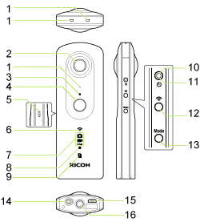
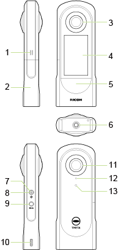

# Plugin Development Tips

### Contents

* [Get Started for Plugin Development](#get-started-for-plugin-development)  
* [Permission Declaration](#permission-declaration)  
* [Enable/Disable logcat output](#enabledisable-logcat-output)  
* [Start a Plugin](#start-a-plugin)  
* [Finish a Plugin](#finish-a-plugin)  
* [Control the Camera](#control-the-camera)  
* [Control the Devices](#control-the-devices)  
* [WebUI](#webui)  
* [Important Notes for Plugin Development](#important-notes-for-plugin-development)  
  * [Version Information](#version-information)  
  * [Open Source Licenses](#open-source-licenses)  
  * [Specify Supported RICOH THETA Models](#specify-supported-ricoh-theta-models)  
* [Names of Camera Parts](#names-of-camera-parts)  

## Get Started for Plugin Development

1. Acquire RICOH THETA V<sup>\*1</sup>, Z1 or X.  
1. Register to RICOH THETA Plugin Partner Program. Please refer to [here](../core/products/theta-plugin.md#how-to-join-the-ricoh-theta-plugin-partner-program).  
1. Enable THETA developer mode using the [RICOH desktop application](https://www.ricoh360.com/ja/apps/) on Mac or Windows.  
1. Install [Android&trade; Studio](https://developer.android.com/studio/install?hl=en).
1. Connect THETA with USB cable.
1. Execute `adb devices` command from terminal and ready when the device name appears.

    ```
    >adb devices
    List of devices attached
    YR30123456      device
    ```

1. Download [RICOH THETA Plugin SDK](https://github.com/ricohapi/theta-plugin-sdk).
1. Develop THETA plugin as the Android&trade; application, based on RICOH THETA Plugin SDK.
1. Debugging with the Run button etc. then THETA plugin will be installing and run on THETA.

<sup>\*1</sup> Update firmware to the latest version, later than v2.30.1.  

## Permission Declaration

When installing from the RICOH THETA Store, permissions are automatically granted based on the protection level defined in the manifest file. During development, use an application such as Vysor to display the screen, and grant permissions manually via the application settings or a plugin dialog window, only for THETA V and Z1.   

You can also launch Android Setting app by following adb command.

```
adb shell am start com.android.settings
```

## Enable/Disable logcat output

For RICOH THETA Z1 (firmware version 1.50.1 and later) and RICOH THETA X (firmware version 1.20.0 and later), the debug log (logcat) is not output by default.  
Use the following ADB command to output the logcat.  
Note that the power consumption will increase when many logcat is output.  

Enable logcat output

```
adb shell setprop persist.log.tag 0
```

Disable logcat output

```
adb shell setprop persist.log.tag A
```

## Start a Plugin

#### THETA V
1. Set the plugin you want to launch via WebAPI [camera._setPlugin](../theta-web-api-v2.1/commands/camera._set_plugin.md). You can do the same thing using the [RICOH desktop application](https://www.ricoh360.com/ja/apps/) as well. 
1. Press Mode Button for 2 seconds to launch the plugin.

#### THETA Z1
1. Set up to three plugins you want to launch via WebAPI [camera._setPluginOrders](../theta-web-api-v2.1/commands/camera._set_plugin_orders.md). You can do the same thing using the [RICOH desktop application](https://www.ricoh360.com/ja/apps/) as well. 
1. Press Mode Button for 2 seconds and select/launch the specified plugin.

#### THETA X
You can swipe LCD touch screen to show the list of installed plugin. Then select the plugin you want to launch.

## Finish a Plugin

Press the Mode Button for 2 seconds.  
This method is implemented in [RICOH THETA Plugin Library](https://github.com/ricohapi/theta-plugin-library). Plugin must send a Broadcast Intent [Notification Completion of Plugin](./broadcast-intent.md#notifying-completion-of-plugin) when it finished.  

## Control the Camera

A Plugin can use [Web API](./web-api.md) or [Camera API](./camera-api.md) to control the camera resource.  

## Control the Devices

A Plugin can use [Broadcast Intent](./broadcast-intent.md) to control several devices; sucn as LED/OLED, WLAN mode, SE, etc.  

## WebUI

A plugin can include a web server and provide a WebUI or its own API. By using port 8888 on the web server launched by the plugin, it becomes possible for a basic app on a smartphone to access the plugin's home page.  
The client can check whether a web server is available by using the Web API command [camera._listPlugins](../theta-web-api-v2.1/commands/camera._list_plugins.md). The information returned by `camera._listPlugins` is based on the configuration file `\assets\settings.json` included in each plugin.
If the configuration file is missing or contains invalid values, default values will be returned by `camera._listPlugins`.

The following setting can be specified in the configuration file:

~~~
{
  "webServer": true
}
~~~

You can refer to sample source code of [Wireless Live Streaming Plugin](https://github.com/ricohapi/theta-wireless-live-streaming-plugin) to know how to implement WebUI in your plugin.  

## Important Notes for Plugin Development

* The maximum size of the APK file is 256 MB.  
* The maximum length of the plugin’s package name is 64 characters.  
* The file extension must be .apk. .xapk is not supported.  
* Please refer to [versioning information](#version-information) for rules regarding version numbers.  
* Please refer to [open source licenses](#open-source-licenses) for rules regarding open source licenses.
* Please refer to [Specify Supported THETA Models](#specify-supported-ricoh-theta-models) for rules regarding supported THETA models.
* Please refer to [finish plugin](#finish-a-plugin) for rules that plugin must finish when presssing the Mode Button for 2 seconds.  
* Plugins are not allowed to start services.  

### Version Information

The plugin version is composed of a major version, a minor version, and a build number, separated by decimal points. The major and minor versions can each use up to 2 digits, and the build number can use up to 4 digits.  
For example: `1.2.3` `12.34.5678`  

### Open Source Licenses

By including the open source license information used by the plugin in the `\assets\licenses.html` file within the plugin APK, the license information can be retrieved using the Web API command `camera._getPluginLicense`.  
If the plugin does not use any open source software, please use the following code:  

```html
<html>
  <head>
    <meta http-equiv="Content-Type" content="text/html; charset=windows-1252">
    <style type="text/css">
      body { padding: 0; font-family: sans-serif; }
    </style>
  </head>
  <body topmargin="0" leftmargin="0" rightmargin="0" bottommargin="0">
    <div>
      <p>This plugin does not use open source software.</p>
    </div>
  </body>
</html>
```

### Specify Supported RICOH THETA Models

The plugin must specify which RICOH THETA models are supported.  
The plugin can only be installed on the camera model defined in the manifest.  
Use the following syntax to declare the target camera model in your `AndroidManifest.xml` file. For example, if the plugin does not support RICOH THETA V or Z1 and only supports RICOH THETA X, declare the following in your `AndroidManifest.xml` file.

```html
<uses-feature android:name="com.theta360.receptor.x"  android:required="true"/>
<uses-feature android:name="com.theta360.receptor.z1" android:required="false"/>
<uses-feature android:name="com.theta360.receptor.v"  android:required="false"/>
```

> [!IMPORTANT]  
> For THETA X firmware v1.00.2 make sure to list the THETA X model specification on the first line.  

## Names of Camera Parts

### RICOH THETA V



1. Microphone (x4)  
2. Lens  
3. Camera Status Light (LED2)  
4. Shutter Button  
5. Speaker  
6. WLAN Status Light (LED3)  
7. Capture Mode Light (LED4, LED5, LED6)  
8. Video Recording Light (LED7)  
9. Memory Warning Light (LED8)  
10. Power Status Light (LED1)  
11. Power Button  
12. WLAN Button  
13. Mode Button  
14. Microphone Jack  
15. USB Port (Micro-B)  
16. Tripod Mount Hole  

### RICOH THETA Z1


1. Speaker  
2. Rear Lens  
3. Microphone (x4)  
4. Shutter Button  
5. Camera Status Light (LED2)  
6. OLED  
7. USB Port (Type-C)  
8. Wrist Strap Hole  
9. Tripod Mount Hole  
10. Power Status Light (LED1)  
11. Power Button  
12. WLAN Button  
13. Mode Button  
14. Fn Button  
15. Front Lens  

### RICOH THETA X



1. Speaker
2. Battery/Micro SD Card Cover
3. Rear Lens
4. Touch LCD Panel
5. Shutter Button  
6. Tripod Mount Hole  
7. Power Status Light (LED1)  
8. Power Button  
9. Mode Button  
10. USB Port (Type-C)  
11. Front Lens  
12. Microphone (x1)  
13. Camera Status Light (LED2)  
