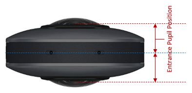

# THETA Lens Spec

This page explains THETA's fisheye lens' characteristic value, especially for distortion table.   

> [!NOTE]  
> They are just design value. If you want more accurate characteristics, you need to do calibration process for each camera by yourself.  

* [THETA X](#theta-x)  
* [THETA Z1](#theta-z1)  
* [THETA V](#theta-v)  

## THETA X

* Focal Length = 1.37mm  
* Pixel Pitch = 0.8um/px @11K mode, 1.6um/px @5.5K mode  
* [Entrance Pupil Position](#remark) = 13.6mm @90deg  
* Distortion Table  

    |Half AoV [deg]|Image Height [mm]|Pixels(11K) [px]|Pixels(5.5K) [px]|
    |:--:| :--: | :--: | :--: |
    |   0|0.0000|   0.0|   0.0|
    |   1|0.0244|  30.5|  15.3|
    |   2|0.0489|  61.1|  30.5|
    |   3|0.0733|  91.6|  45.8|
    |   4|0.0977| 122.1|  61.1|
    |   5|0.1221| 152.6|  76.3|
    |   6|0.1465| 183.1|  91.6|
    |   7|0.1709| 213.6| 106.8|
    |   8|0.1952| 244.1| 122.0|
    |   9|0.2196| 274.5| 137.3|
    |  10|0.2439| 304.9| 152.5|
    |  11|0.2683| 335.3| 167.7|
    |  12|0.2926| 365.7| 182.9|
    |  13|0.3169| 396.1| 198.0|
    |  14|0.3412| 426.5| 213.2|
    |  15|0.3655| 456.8| 228.4|
    |  16|0.3897| 487.2| 243.6|
    |  17|0.4140| 517.5| 258.8|
    |  18|0.4383| 547.9| 274.0|
    |  19|0.4626| 578.3| 289.1|
    |  20|0.4869| 608.7| 304.3|
    |  21|0.5113| 639.1| 319.5|
    |  22|0.5356| 669.5| 334.8|
    |  23|0.5600| 700.0| 350.0|
    |  24|0.5844| 730.5| 365.2|
    |  25|0.6088| 761.0| 380.5|
    |  26|0.6332| 791.6| 395.8|
    |  27|0.6577| 822.2| 411.1|
    |  28|0.6823| 852.8| 426.4|
    |  29|0.7068| 883.5| 441.8|
    |  30|0.7314| 914.3| 457.1|
    |  31|0.7561| 945.1| 472.5|
    |  32|0.7808| 975.9| 488.0|
    |  33|0.8055|1006.9| 503.4|
    |  34|0.8303|1037.8| 518.9|
    |  35|0.8551|1068.8| 534.4|
    |  36|0.8799|1099.9| 550.0|
    |  37|0.9048|1131.0| 565.5|
    |  38|0.9298|1162.2| 581.1|
    |  39|0.9548|1193.4| 596.7|
    |  40|0.9798|1224.7| 612.4|
    |  41|1.0048|1256.0| 628.0|
    |  42|1.0299|1287.4| 643.7|
    |  43|1.0550|1318.8| 659.4|
    |  44|1.0802|1350.2| 675.1|
    |  45|1.1053|1381.6| 690.8|
    |  46|1.1305|1413.1| 706.5|
    |  47|1.1556|1444.5| 722.3|
    |  48|1.1808|1476.0| 738.0|
    |  49|1.2060|1507.5| 753.7|
    |  50|1.2311|1538.9| 769.4|
    |  51|1.2562|1570.3| 785.1|
    |  52|1.2813|1601.7| 800.8|
    |  53|1.3064|1633.0| 816.5|
    |  54|1.3314|1664.2| 832.1|
    |  55|1.3563|1695.4| 847.7|
    |  56|1.3812|1726.5| 863.2|
    |  57|1.4059|1757.4| 878.7|
    |  58|1.4306|1788.3| 894.1|
    |  59|1.4552|1819.0| 909.5|
    |  60|1.4797|1849.6| 924.8|
    |  61|1.5040|1880.0| 940.0|
    |  62|1.5282|1910.2| 955.1|
    |  63|1.5522|1940.2| 970.1|
    |  64|1.5760|1970.1| 985.0|
    |  65|1.5997|1999.6| 999.8|
    |  66|1.6232|2029.0|1014.5|
    |  67|1.6465|2058.1|1029.0|
    |  68|1.6695|2086.9|1043.5|
    |  69|1.6924|2115.4|1057.7|
    |  70|1.7149|2143.7|1071.8|
    |  71|1.7373|2171.6|1085.8|
    |  72|1.7593|2199.1|1099.6|
    |  73|1.7811|2226.3|1113.2|
    |  74|1.8025|2253.2|1126.6|
    |  75|1.8237|2279.6|1139.8|
    |  76|1.8445|2305.6|1152.8|
    |  77|1.8650|2331.2|1165.6|
    |  78|1.8851|2356.4|1178.2|
    |  79|1.9049|2381.1|1190.6|
    |  80|1.9243|2405.3|1202.7|
    |  81|1.9433|2429.1|1214.5|
    |  82|1.9619|2452.3|1226.2|
    |  83|1.9800|2475.0|1237.5|
    |  84|1.9978|2497.2|1248.6|
    |  85|2.0151|2518.8|1259.4|
    |  86|2.0319|2539.9|1269.9|
    |  87|2.0483|2560.3|1280.2|
    |  88|2.0642|2580.2|1290.1|
    |  89|2.0796|2599.5|1299.7|
    |  90|2.0942|2617.8|1308.9|
    |  91|2.1089|2636.1|1318.1|
    |  92|2.1228|2653.5|1326.8|
    |  93|2.1362|2670.2|1335.1|
    |  94|2.1490|2686.3|1343.1|
    |  95|2.1613|2701.6|1350.8|
    |  96|2.1730|2716.3|1358.1|
    |  97|2.1842|2730.2|1365.1|
    |  98|2.1948|2743.5|1371.7|
    |  99|2.2048|2756.0|1378.0|
    | 100|2.2142|2767.7|1383.9|

## THETA Z1

* Focal Length = 2.57mm  
* Pixel Pitch = 2.4um/px  
* [Entrance Pupil Position](#remark) = 12.8mm @90deg  
* Distortion Table  

    |Half AoV [deg]|Image Height [mm]|Pixels [px]|
    |:--:| :--: | :--: |
    |   0|0.0000|   0.0|
    |   1|0.0451|  18.8|
    |   2|0.0902|  37.6|
    |   3|0.1354|  56.4|
    |   4|0.1806|  75.3|
    |   5|0.2259|  94.1|
    |   6|0.2714| 113.1|
    |   7|0.3169| 132.1|
    |   8|0.3626| 151.1|
    |   9|0.4085| 170.2|
    |  10|0.4546| 189.4|
    |  11|0.5009| 208.7|
    |  12|0.5474| 228.1|
    |  13|0.5941| 247.5|
    |  14|0.6411| 267.1|
    |  15|0.6884| 286.8|
    |  16|0.7359| 306.6|
    |  17|0.7837| 326.5|
    |  18|0.8317| 346.6|
    |  19|0.8801| 366.7|
    |  20|0.9287| 387.0|
    |  21|0.9776| 407.3|
    |  22|1.0268| 427.8|
    |  23|1.0762| 448.4|
    |  24|1.1259| 469.1|
    |  25|1.1758| 489.9|
    |  26|1.2259| 510.8|
    |  27|1.2762| 531.7|
    |  28|1.3266| 552.8|
    |  29|1.3772| 573.8|
    |  30|1.4279| 595.0|
    |  31|1.4787| 616.1|
    |  32|1.5295| 637.3|
    |  33|1.5804| 658.5|
    |  34|1.6313| 679.7|
    |  35|1.6822| 700.9|
    |  36|1.7330| 722.1|
    |  37|1.7838| 743.2|
    |  38|1.8344| 764.3|
    |  39|1.8850| 785.4|
    |  40|1.9354| 806.4|
    |  41|1.9857| 827.4|
    |  42|2.0358| 848.2|
    |  43|2.0857| 869.0|
    |  44|2.1354| 889.7|
    |  45|2.1848| 910.4|
    |  46|2.2341| 930.9|
    |  47|2.2831| 951.3|
    |  48|2.3319| 971.6|
    |  49|2.3804| 991.9|
    |  50|2.4287|1012.0|
    |  51|2.4767|1032.0|
    |  52|2.5244|1051.9|
    |  53|2.5719|1071.6|
    |  54|2.6191|1091.3|
    |  55|2.6660|1110.8|
    |  56|2.7126|1130.3|
    |  57|2.7590|1149.6|
    |  58|2.8051|1168.8|
    |  59|2.8509|1187.9|
    |  60|2.8964|1206.8|
    |  61|2.9417|1225.7|
    |  62|2.9867|1244.5|
    |  63|3.0315|1263.1|
    |  64|3.0760|1281.6|
    |  65|3.1202|1300.1|
    |  66|3.1641|1318.4|
    |  67|3.2078|1336.6|
    |  68|3.2512|1354.7|
    |  69|3.2944|1372.7|
    |  70|3.3372|1390.5|
    |  71|3.3798|1408.2|
    |  72|3.4220|1425.8|
    |  73|3.4639|1443.3|
    |  74|3.5055|1460.6|
    |  75|3.5467|1477.8|
    |  76|3.5875|1494.8|
    |  77|3.6279|1511.6|
    |  78|3.6679|1528.3|
    |  79|3.7074|1544.7|
    |  80|3.7463|1561.0|
    |  81|3.7848|1577.0|
    |  82|3.8226|1592.8|
    |  83|3.8599|1608.3|
    |  84|3.8965|1623.6|
    |  85|3.9325|1638.5|
    |  86|3.9678|1653.3|
    |  87|4.0024|1667.7|
    |  88|4.0362|1681.7|
    |  89|4.0692|1695.5|
    |  90|4.1011|1708.8|
    |  91|4.1329|1722.0|
    |  92|4.1635|1734.8|
    |  93|4.1932|1747.2|
    |  94|4.2221|1759.2|
    |  95|4.2501|1770.9|
    |  96|4.2772|1782.2|
    |  97|4.3034|1793.1|
    |  98|4.3288|1803.7|
    |  99|4.3533|1813.9|
    | 100|4.3768|1823.7|

## THETA V

* THETA S/SC/SC2 also use same lens unit.  
* Focal Length = 1.30mm  
* Pixel Pitch = 1.55um/px  
* [Entrance Pupil Position](#remark) = 9.8mm @90deg  
* Distortion Table  

    |Half AoV [deg]|Image Height [mm]|Pixels [px]|
    |:--:| :--: | :--: |
    |   0|0.0000|   0.0|
    |   1|0.0230|  14.8|
    |   2|0.0459|  29.6|
    |   3|0.0689|  44.5|
    |   4|0.0919|  59.3|
    |   5|0.1148|  74.1|
    |   6|0.1378|  88.9|
    |   7|0.1608| 103.7|
    |   8|0.1837| 118.5|
    |   9|0.2067| 133.3|
    |  10|0.2296| 148.1|
    |  11|0.2526| 162.9|
    |  12|0.2755| 177.7|
    |  13|0.2984| 192.5|
    |  14|0.3213| 207.3|
    |  15|0.3442| 222.1|
    |  16|0.3671| 236.9|
    |  17|0.3900| 251.6|
    |  18|0.4129| 266.4|
    |  19|0.4357| 281.1|
    |  20|0.4586| 295.9|
    |  21|0.4814| 310.6|
    |  22|0.5042| 325.3|
    |  23|0.5270| 340.0|
    |  24|0.5498| 354.7|
    |  25|0.5725| 369.4|
    |  26|0.5953| 384.0|
    |  27|0.6180| 398.7|
    |  28|0.6407| 413.3|
    |  29|0.6633| 428.0|
    |  30|0.6860| 442.6|
    |  31|0.7086| 457.2|
    |  32|0.7312| 471.8|
    |  33|0.7538| 486.3|
    |  34|0.7764| 500.9|
    |  35|0.7990| 515.5|
    |  36|0.8215| 530.0|
    |  37|0.8440| 544.5|
    |  38|0.8665| 559.0|
    |  39|0.8890| 573.6|
    |  40|0.9115| 588.1|
    |  41|0.9340| 602.6|
    |  42|0.9564| 617.0|
    |  43|0.9789| 631.5|
    |  44|1.0013| 646.0|
    |  45|1.0237| 660.5|
    |  46|1.0461| 674.9|
    |  47|1.0685| 689.4|
    |  48|1.0909| 703.8|
    |  49|1.1133| 718.3|
    |  50|1.1357| 732.7|
    |  51|1.1580| 747.1|
    |  52|1.1804| 761.5|
    |  53|1.2027| 775.9|
    |  54|1.2250| 790.3|
    |  55|1.2473| 804.7|
    |  56|1.2695| 819.0|
    |  57|1.2917| 833.4|
    |  58|1.3139| 847.7|
    |  59|1.3361| 862.0|
    |  60|1.3582| 876.3|
    |  61|1.3803| 890.5|
    |  62|1.4023| 904.7|
    |  63|1.4242| 918.9|
    |  64|1.4461| 933.0|
    |  65|1.4680| 947.1|
    |  66|1.4897| 961.1|
    |  67|1.5114| 975.1|
    |  68|1.5329| 989.0|
    |  69|1.5544|1002.8|
    |  70|1.5758|1016.6|
    |  71|1.5970|1030.3|
    |  72|1.6181|1043.9|
    |  73|1.6390|1057.4|
    |  74|1.6598|1070.9|
    |  75|1.6804|1084.2|
    |  76|1.7009|1097.3|
    |  77|1.7211|1110.4|
    |  78|1.7411|1123.3|
    |  79|1.7609|1136.0|
    |  80|1.7804|1148.6|
    |  81|1.7996|1161.1|
    |  82|1.8186|1173.3|
    |  83|1.8372|1185.3|
    |  84|1.8556|1197.1|
    |  85|1.8736|1208.7|
    |  86|1.8912|1220.1|
    |  87|1.9084|1231.2|
    |  88|1.9253|1242.1|
    |  89|1.9417|1252.7|
    |  90|1.9575|1262.9|
    |  91|1.9733|1273.1|
    |  92|1.9884|1282.8|
    |  93|2.0030|1292.3|
    |  94|2.0172|1301.4|
    |  95|2.0308|1310.2|
    |  96|2.0440|1318.7|
    |  97|2.0566|1326.9|
    |  98|2.0688|1334.7|
    |  99|2.0804|1342.2|
    | 100|2.0915|1349.3|

## Remark

`Entrance Pupil Position` is defined as the distance between the midpoint of the two lens units and the entrance pupil position of each lens, like following picture.  

