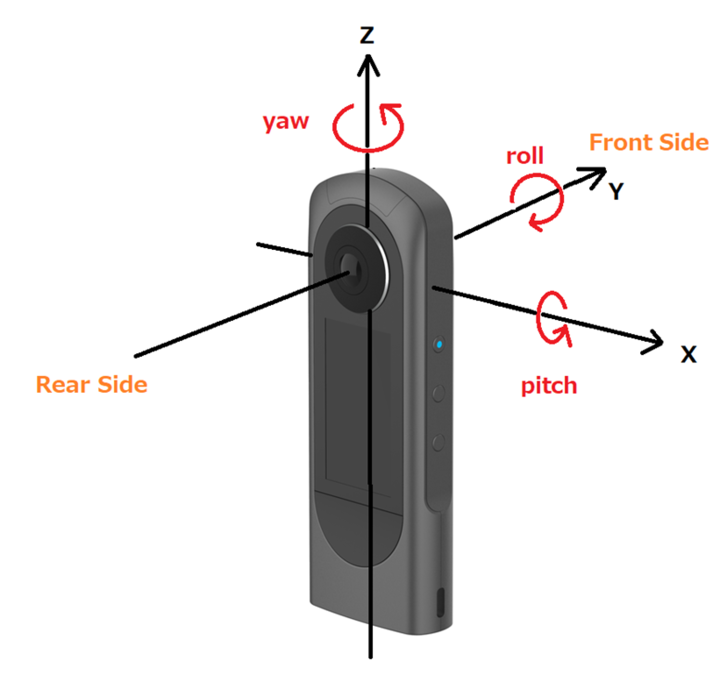

# THETA Metadata Spec

RICOH THETA MP4 file have two types of metadata which stores IMU sensor data, GNSS sensor data, and related timestamp information.  
Basic structure of RICOH THETA MP4 files is following, and vendor specified metadata is stored under `udta` box and in `CaMM` track.

> * ftyp
> * mdat
> * moov
>    * mvhd
>    * trak (video)
>        * tkhd
>        * mdia
>            * ....
>        * uuid `ffcc8263-f855-4a93-8814-587a02521fdd`
>    * trak (audio)
>        * ....
>    * [trak (CaMM)](#camm-track)
>        * ....
>    * meta
>        * ....
>    * [udta](#udta-box)
>        * ....
> * uuid `28F311E2-B791-4F6F-94E2-4F5DEACB3C01`

----

## Axis Definition

The side where the shutter button is located is defined as Rear, for all THETA model.  



----

## UDTA Box

`udta` box has following child-boxes.

| Name |  |  |  |  |  |  |  |  | Description |
| :--- | :---: | :---: | :---: | :---: | :---: | :---: | :---: | :---: | :--- |
| RTHU | ✓ | ✓ | ✓ | ✓ | ✓ | ✓ | ✓ |   | Thumbnail |
| RMKN | ✓ | ✓ | ✓ | ✓ | ✓ | ✓ | ✓ |   | *Details Not Disclosed* |
| RDT1-8 |   | ✓ | ✓ |   | ✓ | ✓ | ✓ |   | *Details Not Disclosed* |
| RDT9   | ✓ | ✓ | ✓ |   |   |   |   |   | *Details Not Disclosed* |
| [RDTA](#rdta) | ✓ | ✓ | ✓ | ✓ | ✓ | ✓ |   |   | Accelerometer |
| [RDTB](#rdtb) | ✓ | ✓ | ✓ | ✓ |   |   |   |   | Gyroscope |
| [RDTC](#rdtc) | ✓ | ✓ | ✓ |   |   | ✓ |   |   | Ambient magnetic field |
| RDTD | ✓ | ✓ | ✓ |   |   |   |   |   | *Details Not Disclosed* |
| [RDTG](#rdtg) | ✓ | ✓ | ✓ | ✓ |   |   |   |   | Timestamp for each video frame |
| RDTH |   |   |   | ✓ |   |   |   |   | Quarternion for each video frame |
| RDTI | ✓ | ✓ | ✓ |   |   |   |   |   | *Details Not Disclosed* |
| [RDTL](#rdtl) | ✓ <br> \*1 |   |   |   |   |   |   |   | GNSS location |
| [RDL2](#rdl2) | ✓ <br> \*1\*2 |   |   |   |   |   |   |   | GNSS location + accuracy |
| @mod | ✓ | ✓ | ✓ | ✓ | ✓ | ✓ | ✓ |   | Model name <br> e.g. `RICOH THETA X` |
| @swr | ✓ | ✓ | ✓ | ✓ | ✓ | ✓ | ✓ |   | Software version <br> e.g. `RICOH THETA X Ver 2.21.0` |
| @day | ✓ | ✓ | ✓ | ✓ | ✓ | ✓ |   |   | Date/Time with timezone <br> e.g. `2023-04-01T09:00+09:00` |
| @xyz | ✓ | ✓ | ✓ | ✓ | ✓ | ✓ |   |   | GNSS location <br> e.g. `+35.7101+139.8108+0032` |
| @mak | ✓ | ✓ | ✓ | ✓ | ✓ | ✓ | ✓ |   | Manufacturer <br> `RICOH` |
| manu | ✓ | ✓ | ✓ |   |   |   |   |   | Same as `@mak` |
| modl | ✓ | ✓ | ✓ |   |   |   |   |   | Same as `@mod` |

\*1 : Serial number started with `YR12` (shipped to China) will not store this type data in any case.  
\*2 : RICOH THETA X firmware v2.61.0 or later.  

### RDT* Atom

| Data field | Format | Bytes | Description |
| :--- | :---: | :---: | :--- |
| Size | `uint32` | 4 | |
| Type | `uint32` | 4 | e.g. `RDTA` |
| Number of entries | `uint32` | 4 | |
| Sampling rate | `uint16` | 2 | [Hz] |
| Sample size | `uint16` | 2 | e.g. `0x18` |
| Endian | `uint16` | 2 | Little endian : `0x0123` <br> Big endian : `0x3210`
| Reserve | `uint16[3]` | 6 | `0x00..00` \*1 |
| Data Table | | Variable | Data Table is stored as array of [Data Packet](#data-packet-format). |

\*1 :  
RICOH THETA X firmware v2.40.0 or later puts the value of "timestamp" of 1st data packet as [msec] for RDTL.  
RICOH THETA X firmware v2.61.0 or later puts the value of "timestamp" of 1st data packet as [msec] for RDL2.  

### Data Packet Format

#### RDTA

RDTA stores Accelerometer sensor data.

| Data | Format | Bytes | Description |
| :--- | :---: | :---: | :--- |
| x | `float` | 4 | [m/s^2] |
| y | `float` | 4 | [m/s^2] |
| z | `float` | 4 | [m/s^2] |
| reserve | `float` | 4 | |
| timestamp | `uint64` | 8 | [nsec] |

#### RDTB

RDTB stores Gyroscope sensor data.

| Data | Format | Bytes | Description |
| :--- | :---: | :---: | :--- |
| x | `float` | 4 | [rad/s] |
| y | `float` | 4 | [rad/s] |
| z | `float` | 4 | [rad/s] |
| reserve | `float` | 4 | |
| timestamp | `uint64` | 8 | [nsec] |

#### RDTC

RDTC stores Ambient magnetic field sensor data.

| Data | Format | Bytes | Description |
| :--- | :---: | :---: | :--- |
| x | `float` | 4 | [μT] |
| y | `float` | 4 | [μT] |
| z | `float` | 4 | [μT] |
| reserve | `float` | 4 | |
| timestamp | `uint64` | 8 | [nsec] |

#### RDTG

RDTG stores timestamp information for each video frame.  
This timestamp indicates the center of exposure considering with exposure time and rolling shutter skew.

| Data | Format | Bytes | Description |
| :--- | :---: | :---: | :--- |
| timestamp | `uint64` | 8 | [nsec] |

#### RDTL

RDTL stores GNSS location sensor data.

| Data | Format | Bytes | Description |
| :--- | :---: | :---: | :--- |
| timestamp | `double` | 8 | GPS time epoch [sec] |
| latitude | `double` | 8 | [deg] |
| longitude | `double` | 8 | [deg] |
| altitude | `double` | 8 | [m] |

#### RDL2

RDL2 stores GNSS location + accuracy sensor data.

| Data | Format | Bytes | Description |
| :--- | :---: | :---: | :--- |
| timestamp | `double` | 8 | GPS time epoch [sec] |
| gps_fix_type | `int16` | 2 | `0` (no fix), `2` (2D fix), `3` (3D fix) |
| latitude | `double` | 8 | [deg] |
| longitude | `double` | 8 | [deg] |
| altitude | `float` | 4 | [m] |
| horizontal_accuracy | `float` | 4 | [m] |
| vertical_accuracy | `float` | 4 | [m] |
| velocity_east | `float` | 4 | [m/s] |
| velocity_north | `float` | 4 | [m/s] |
| velocity_up | `float` | 4 | [m/s] , always `0.0f` |
| speed_accuracy | `float` | 4 | [m/s] |

### Sample How to Find Data Packet from RDTA Box

```
00 02 62 B4 52 44 54 41 71 19 00 00 C8 00 18 00
~~~~~~~~~~~ ~~~~~~~~~~~ ~~~~~~~~~~~ ~~~~~ ~~~~~
|           |           |           |     └ SampleSize = 0x0018 (24)
|           |           |           └ SamplingRate = 0x00C8 (200)
|           |           └ Entries = 0x00001971 (6513)
|           └ Type = "RDTA"
└ Size = 0x000262B4 (156340)

23 01 00 00 00 00 00 00 76 FD 9C BC 31 7C 6B BC
~~~~~ ~~~~~~~~~~~~~~~~~ ~~~~~~~~~~~ ~~~~~~~~~~~
|     |                 |           └ y[0] = -0.014
|     └ Reserve         └ x[0] = -0.019
└ Endian = 0x2301 (Little Endian)

D1 23 1E 41 00 00 00 00 80 64 B0 09 05 0A 00 00
~~~~~~~~~~~ ~~~~~~~~~~~ ~~~~~~~~~~~~~~~~~~~~~~~
|           |           └ timestamp[0] = 11016753669248
|           └ reserve
└ z[0] = +9.883

82 DC 57 3D 76 FD 1C 3D 5D 61 1B 41 00 00 00 00
~~~~~~~~~~~ ....
└ x[1] = +0.052  

```

----

## CaMM Track

CaMM is *Camera Motion Metadata* defined by Google. Refer to [spec](https://developers.google.com/streetview/publish/camm-spec) for detail.  
RICOH THETA MP4 file also have CaMM track in following modes. 

* RICOH THETA X
    * 8K (7680x3840px) 10fps, 5fps, 2fps
    * 5.7K (5760x2880px) 10fps, 5fps, 2fps
    * 2.7K (2752x2752px) 10fps, 5fps, 2fps
* RICOH THETA Z1
    * 3.6K (3648x3648px) 2fps, 1fps
    * 2.7K (2688x2688px) 2fps, 1fps

### Supported Data Type

| Type |  |  | Description |
| :--- | :---: | :---: | :--- |
| 0 |   |   | `angle_axis` |
| 1 |   |   | `pixel_exposure_time` <br> and `rolling_shutter_skew_time` |
| 2 | ✓ | ✓ | `gyro` |
| 3 | ✓ | ✓ | `Accelerometer` |
| 4 |   |   | `position` |
| 5 | ✓ <br> \*1 |   | `latitude`, <br> `longitude`, <br> and `altitude` |
| 6 | ✓ <br> \*1\*2 |   | 5 plus <br> `time_gps_epoch`, <br> `gps_fix_type`, <br> and some `*_accuracy` data |
| 7 |   |   | `magnetic_field` |

\*1 : Serial number started with `YR12` (shipped to China) will not store this type data in any case.  
\*2 : RICOH THETA X firmware v2.61.0 or later.  

### Track Structure

You can parse CaMM track to each data packet with using `stts`, `stsz`, and `co64` atoms' information.

> * trak (CaMM)
>    * tkhd
>    * mdia
>        * mdhd
>        * [hdlr](#handler-reference-atom)
>        * minf
>            * dinf
>               * dref
>        * stbl
>           * stsd
>               * camm
>           * [stts](#time-to-sample-atom)
>           * [stsc](#sample-to-chunk-atom)
>           * [stsz](#sample-to-size-atom)
>           * [co64](#chunk-offset-atom)

#### Handler Reference Atom

| Data field | Format | Bytes | Description |
| :--- | :---: | :---: | :--- |
| Size | `uint32` | 4 | `0x3C` |
| Type | `uint32` | 4 | `hdlr` |
| Version | `uint32` | 4 | `0` |
| Pre-defined | `uint32` | 4 | `mhlr` |
| Handler Type | `uint32` | 4 | `camm` |
| Reserved | `uint32[3]` | 12 | ---- |
| Name | `String` | 28 | `CameraMetadataMotionHandler` + `0x00` | 

#### Time-to-Sample Atom

| Data field | Format | Bytes | Description |
| :--- | :---: | :---: | :--- |
| Size | `uint32` | 4 |  |
| Type | `uint32` | 4 | `stts` |
| Version | `uint32` | 1 | `0` |
| Flags | ---- | 3 | `0x000000` |
| Number of entries | `uint32` | 4 | The total number of recorded sensor data. <br> e.g. `N` = 10sec * (acc 200Hz + gyro 200Hz + gnss 1Hz) = 4010 |
| Time-to-sample table | `uint32[2]*N` | Variable | Sample count 4 Byte + <br> Sample Duration 4 Byte |

Also refer to [Time-to-sample atom ('stts')](https://developer.apple.com/documentation/quicktime-file-format/time-to-sample_atom) in QuickTime File Format provided by Apple.

#### Sample-to-Chunk Atom

| Data field | Format | Bytes | Description |
| :--- | :---: | :---: | :--- |
| Size | `uint32` | 4 |  |
| Type | `uint32` | 4 | `stsc` |
| Version | `uint32` | 1 | `0` |
| Flags | ---- | 3 | `0x000000` |
| Number of entries | `uint32` | 4 | `N` = 1 |
| Sample-to-chunk table | `uint16[3]*N` | Variable | First chunk 4 Byte + <br> Sample per chunk 4 Byte <br> Sample description ID 4 Byte |

Also refer to [Sample-to-chunk atom ('stsc')](https://developer.apple.com/documentation/quicktime-file-format/sample-to-chunk_atom) in QuickTime File Format provided by Apple.

#### Sample-to-Size Atom

| Data field | Format | Bytes | Description |
| :--- | :---: | :---: | :--- |
| Size | `uint32` | 4 |  |
| Type | `uint32` | 4 | `stsz` |
| Version | `uint32` | 1 | `0` |
| Flags | ---- | 3 | `0x000000` |
| Sample size | `uint32` | 4 | `0x10` or `0x00` (*1) |
| Number of entries | `uint32` | 4 | The total number of recorded sensor data. <br> e.g. `N` = 10sec * (acc 200Hz + gyro 200Hz + gnss 1Hz) = 4010 |
| Sample size table | `uint16*N` | Variable | Sample size 4 Byte (*1) |

(*1) If only `gyro` and `Accelerometer` are stored in CaMM track, Sample size will be `0x10` and Sample size table will be `0x00`. If GNSS location are also stored in CaMM strack, Sample size will be `0x00` and all data packet size information will be stored in Sample size table as array.  
Because, data packet size of `gyto` and `Accelerometer` is `0x10` (16Byte), GNSS location is `0x1C` (28Byte).  

Also refer to [Sample-to-chunk atom ('stsz')](https://developer.apple.com/documentation/quicktime-file-format/sample_size_atom) in QuickTime File Format provided by Apple.

#### Chunk Offset Atom

| Data field | Format | Bytes | Description |
| :--- | :---: | :---: | :--- |
| Size | `uint32` | 4 |  |
| Type | `uint32` | 4 | `co64` |
| Version | `uint32` | 1 | `0` |
| Flags | ---- | 3 | `0x000000` |
| Number of entries | `uint32` | 4 | The total number of recorded sensor data. <br> e.g. `N` = 10sec * (acc 200Hz + gyro 200Hz + gnss 1Hz) = 4010 |
| Chunk offset table | `uint64*N` | Variable | Chunk offset 8 Byte |

Also refer to [Chunk-offset-atom ('stco')](https://developer.apple.com/documentation/quicktime-file-format/chunk_offset_atom) in QuickTime File Format provided by Apple.

### Sample How to Find Data Packet from CaMM Track

STEP 1. Parse stts, stsz, and co64 box to get each information.

```
stts

00 05 B7 38 73 74 74 73 00 00 00 00 00 00 B6 E5
~~~~~~~~~~~ ~~~~~~~~~~~ ~~ ~~~~~~~~ ~~~~~~~~~~~
|           |           |  |        └ Number of entries = 0x0000B6E5 (46821)
|           |           |  └ Flag = 0x000000
|           |           └ Version = 0x00
|           └ Type = "stts"
└ Size = 0x0005B738 (374584)

00 00 00 01 00 00 00 00 00 00 00 01 00 4C 97 57
~~~~~~~~~~~ ~~~~~~~~~~~ ~~~~~~~~~~~ ~~~~~~~~~~~
|           |           |           └ duration[1] = 0x004C9757 (5.019[msec])
|           |           └ count[1] = 1
|           └ duration[0] = 0x00000000 (0.000[msec])
└ count[0] = 1

00 00 00 01 00 00 00 00 00 00 00 01 00 4C 97 57
~~~~~~~~~~~ ~~~~~~~~~~~ ~~~~~~~~~~~ ~~~~~~~~~~~
|           |           |           └ duration[3] = 0x004C9757 (5.019[msec])
|           |           └ count[3] = 1
|           └ duration[2] = 0x00000000 (0.000[msec])
└ count[2] = 1

....

00 00 00 01 00 4C 93 A3 00 00 00 01 00 00 00 00
~~~~~~~~~~~ ~~~~~~~~~~~ ~~~~~~~~~~~ ~~~~~~~~~~~
|           |           |           └ duration[m+1] = 0x00000000 (0.000[msec])
|           |           └ count[m+1] = 1
|           └ duration[m] = 0x004C93A3 (5.018[msec])
└ count[m] = 1

stsz

00 02 DB AC 73 74 73 7A 00 00 00 00 00 00 00 00
~~~~~~~~~~~ ~~~~~~~~~~~ ~~ ~~~~~~~~ ~~~~~~~~~~~
|           |           |  |        └ Sample size = 0x000000
|           |           |  └ Flag = 0x000000
|           |           └ Version = 0x00
|           └ Type = "stsz"
└ Size = 0x0002DBA8 (187304)

00 00 B6 E5 00 00 00 10 00 00 00 10 00 00 00 10
~~~~~~~~~~~ ~~~~~~~~~~~ ~~~~~~~~~~~ ~~~~~~~~~~~
|           |           |           └ size[2] = 0x10(16)
|           |           └ size[1] = 0x10(16)
|           └ size[0] = 0x10(16)
└ Number of entries = 0x0000B6E5 (46821)

....

00 00 00 10 00 00 00 10 00 00 00 1C 00 00 00 10
~~~~~~~~~~~ ~~~~~~~~~~~ ~~~~~~~~~~~ ~~~~~~~~~~~
|           |           |           └ size[m+1] = 0x10(16)
|           |           └ size[m] = 0x1C(24)
|           └ size[m-1] = 0x10(16)
└ size[m-2] = 0x10(16)

co64

00 05 B7 40 63 6F 36 34 00 00 00 00 00 00 B6 E5
~~~~~~~~~~~ ~~~~~~~~~~~ ~~ ~~~~~~~~ ~~~~~~~~~~~
|           |           |  |        └ Number of entries = 0x0000B6E5 (46821)
|           |           |  └ Flag = 0x000000
|           |           └ Version = 0x00
|           └ Type = "co64"
└ Size = 0x0005B738 (374584)

00 00 00 00 00 01 00 28 00 00 00 00 00 01 00 38
~~~~~~~~~~~~~~~~~~~~~~~ ~~~~~~~~~~~~~~~~~~~~~~~
└ offset[0]             └ offset[1]
....

00 00 00 00 00 01 31 28 00 00 00 00 00 01 31 44
~~~~~~~~~~~~~~~~~~~~~~~ ~~~~~~~~~~~~~~~~~~~~~~~
└ offset[m]             └ offset[m+1]

....
```

STEP 2. Read the data packet with offset (by `co64`) and size (by `stsz`).

``````
ADDRESS    00 01 02 03 04 05 06 07 08 09 0A 0B 0C 0D 0E 0F
----------------------------------------------------------
0x00010020 96 96 96 96 96 96 97 07 00 00 02 00 01 EF A6 BE 
                                   ~~~~~~~~~~~~~~~~~~~~~~~
                                   └ data_packet[0]
0x00010030 03 72 AD 3D 00 77 CA BD 00 00 03 00 A4 4A EB BE 
           ~~~~~~~~~~~~~~~~~~~~~~~ ~~~~~~~~~~~~~~~~~~~~~~~
                                   └ data_packet[1]
0x00010040 A6 B2 4A BF 9E DA 26 41 00 00 02 00 1C EE D6 BE 
           ~~~~~~~~~~~~~~~~~~~~~~~ ~~~~~~~~~~~~~~~~~~~~~~~
                                   └ data_packet[2]
0x00010050 6B FE 83 3D BB 3D D0 BE 00 00 03 00 2D 6D 7E BE 
           ~~~~~~~~~~~~~~~~~~~~~~~ ~~~~~~~~~~~~~~~~~~~~~~~
                                   └ data_packet[3]
0x00010060 7A 00 37 BF 3E 8D 22 41 00 00 02 00 0F 1C F7 BE 
           ~~~~~~~~~~~~~~~~~~~~~~~ ....
....
0x00013120 0A 52 D5 BD FA 3B 2A 41 00 00 05 00 02 50 B2 C2
                                   ~~~~~~~~~~~~~~~~~~~~~~~
                                   └ data_packet[m] 
0x00013130 1A C8 41 40 0E 08 87 F1 2D 71 61 40 CD CC CC CC 
           ~~~~~~~~~~~~~~~~~~~~~~~~~~~~~~~~~~~~~~~~~~~~~~~ 
0x00013140 CC 0C 42 40 00 00 02 00 EC 00 41 3E 1A 2C 8F 3E
           ~~~~~~~~~~~ ~~~~~~~~~~~~~~~~~~~~~~~~~~~~~~~~~~~
                       └ data_packet[m+1]
```````

STEP 3. Parse the data packet based on CaMM spec.

```
data_packet[0] 00 00 02 00 01 EF A6 BE 03 72 AD 3D 00 77 CA BD
               ~~~~~ ~~~~~ ~~~~~~~~~~~ ~~~~~~~~~~~ ~~~~~~~~~~~
               |     |     └ x=-0.326  └ y=+0.084  └ z=-0.098
               |     └ type = 2 (gyro)      
               └ reserve

data_packet[1] 00 00 03 00 A4 4A EB BE A6 B2 4A BF 9E DA 26 41
               ~~~~~ ~~~~~ ~~~~~~~~~~~ ~~~~~~~~~~~ ~~~~~~~~~~~
               |     |     └ x=-0.459  └ y=-0.791  └ z=+10.428
               |     └ type = 3 (acc)      
               └ reserve

data_packet[m] 00 00 05 00 02 50 B2 C2 1A C8 41 40 0E 08 87 F1 
               ~~~~~ ~~~~~ ~~~~~~~~~~~~~~~~~~~~~~~ ~~~~~~~~~~~
               |     |     └ lat = +35.563316      └ lng = +139.536858
               |     └ type = 5 (gps)      
               └ reserve

               2D 71 61 40 CD CC CC CC CC 0C 42 40
               ~~~~~~~~~~~ ~~~~~~~~~~~~~~~~~~~~~~~ ....
                           └ alt = +36.1
```

#### Parse Result 

| # | Type | Value | Unit | Duration | Unit |
| :---: | :---: | :---: | :---: | :---: | :---: |
| 0 | gyro | (  -0.326,  +0.084,  -0.098 ) | [rad/s] | 0.000 | [msec] |
| 1 | acc  | (  -0.459,  -0.791, +10.428 ) | [m/s^2] | 5.019 | [msec] |
| 2 | gyro | (  -0.000,  +0.064,  -0.406 ) | [rad/s] | 0.000 | [msec] |
| 3 | acc  | (  -0.248,  -0.714, +10.159 ) | [m/s^2] | 5.019 | [msec] |
| .... | .... | .... | .... | .... | .... |
| m-2 | gyro | (  +0.211,  +0.250,  +0.351 ) | [rad/s] | 0.000 | [msec] |
| m-1 | acc  | (  +0.178,  -0.104, +10.639 ) | [m/s^2] | 0.100 | [msec] |
| m   | gps  | ( +35.563316, +139.536858, +36.1 ) | [deg],[m] | 5.018 | [msec] |
| m+1 | gyro | (  +0.188,  +0.279,  +0.282 ) | [rad/s] | 0.000 | [msec] |
| .... | .... | .... | .... | .... |
