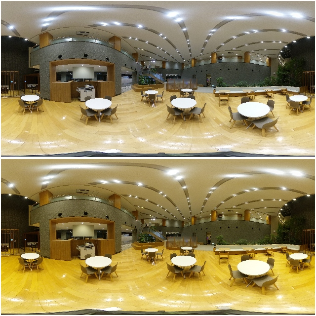

# 0xD83A WhiteBalanceAutoStrength

**Vendor Extension Property**  
Returns or sets the current setting of auto white balance strength for low color temperature scene.  
This property can be set for photo mode and video mode separately. Also this property will not be cleared by power-off.  

### Supported Models
|  |  |  |  |  |
|:-:|:-:|:-:|:-:|:-:|
|   | ✓\*1 |   |   |   |

\*1THETA X firmware v2.20.3 and later

| Field Order | Field Name | Size | Data Type | Description |
|:-:|:--|:-:|:--|:--|
| 1 | Property Code | 2 | UINT16 | `0xD83A` |
| 2 | Datatype | 2 | UINT16 | `0x0002` (UINT8) |
| 3 | Get/Set | 1 | UINT8 | `0x01` (GET/SET) |
| 4 | Default Value | 1 | UINT8 | `0` |
| 5 | Current Value | 1 | UINT8 ||
| 6 | Form Flag | 1 | UINT8 | `0x02` (None) |

| Value | Description |
|:-:|:--|
| `1` |     Correct tint for low color temperature scene |
| `0` | Not correct tint for low color temperature scene |

### Sample Image

Upper image: `1`  
Lower image: `0`  

