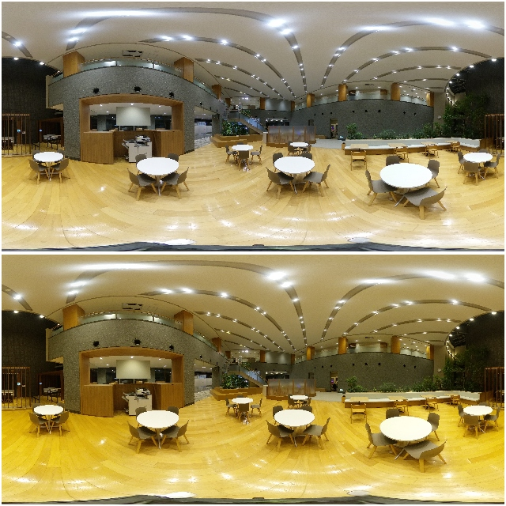

# \_whiteBalanceAutoStrength

### Overview

To set the strength of white balance auto for low color temperature scene. This option can be set for photo mode and video mode separately. Also this option will not be cleared by power-off.

Can be acquired by [camera.getOptions](../commands/camera.get_options.md) and set by [camera.setOptions](../commands/camera.set_options.md).

### Support model

| X | Z1 | V | SC | S |
|:--|:--|:--|:--|:--|
| -- | v2.20.3 or later | -- | -- | -- |

### Support value

| Value | Description |
|:--|:--|
| ON  |     correct tint for low color temperature scene |
| OFF | not correct tint for low color temperature scene |

Upper side: `ON`  
Lower side: `OFF`  

